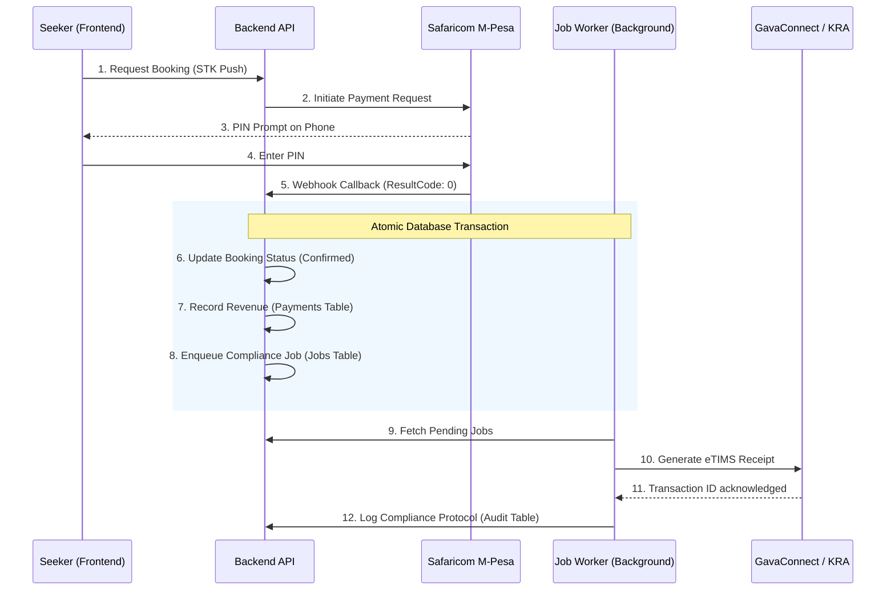

# Financial & Compliance Pipeline Walkthrough

This document explains the end-to-end flow of money and data within the HouseHunt-KE platform, specifically focusing on the integration between **M-Pesa**, **GavaConnect (KRA)**, and the management dashboards.

## 1. End-To-End Architecture

The system uses a **Transactional Outbox Pattern** to ensure that no payment ever goes unrecorded by the tax authorities, even if the KRA API is temporarily down.

---

## 2. Phase Breakdown

### Phase 1: Payment Initiation
*   **Trigger**: Seeker clicks "Book House" and enters their M-Pesa number.
*   **Logic**: `payments.service.ts` -> `createPendingBookingAndInitiateMpesa`.
*   **Security**: The platform fetches the latest `bookingFee` directly from the database to prevent client-side manipulation.

### Phase 2: Payment Confirmation (Auditing)
*   **Trigger**: M-Pesa servers call the `/api/payments/mpesa/callback` route.
*   **Logic**: `handleMpesaCallback` performs an **Idempotency Check** using the `mpesaReceiptNumber`. This prevents duplicate revenue records if a callback is sent twice.
*   **Data Integrity**: A database transaction wraps the booking update and the revenue record.

### Phase 3: Compliance Sync (GavaConnect/KRA)
*   **Trigger**: Background worker (`jobs.service.ts`) detects a pending `kra_etims_sync` job.
*   **Action**: The worker calls `sendRevenueToGava`. This calculates:
    *   **MRI (Monthly Rental Income Tax)**: 7.5% of the rent.
    *   **VAT**: 16% on platform usage fees.
    *   **Tourism Levy**: 2% (if applicable).
*   **Resilience**: If the KRA Sandbox is down, the job remains in "pending" or "queued_locally" status and retries automatically.

---

## 3. Management Protocol (Role-Based)

### Landlord Management (The Yield Ledger)
Landlords access their data via the **Landlord Dashboard**.
*   **Revenue**: They see a filtered view of the `payments` table. The backend enforces `WHERE houses.landlordId = currentUser.userId`.
*   **Compliance**: They see a "Compliance Pulse" indicating their KRA PIN status. They can view the protocol ledger for their specific properties but **cannot** perform manual NIL filings for the platform.

### Administrator Management (The Global Authority)
Administrators using the **Admin Console** have master control.
*   **Platform Yield**: They see the "System Gross Volume" across all landlords.
*   **Active Compliance**: They are the only users who can trigger a **Platform-wide NIL Filing** or manually verify third-party KRA nodes.
*   **Audit Trail**: The "Global Ledger" provides the absolute history of every eTIMS receipt generated by the platform.

---

## 4. Error Handling & Edge Cases

| Scenario | System Response |
| :--- | :--- |
| **STK Push Timeout** | The backend waits for the callback asynchronously. The Seeker sees a "Polling" state until M-Pesa confirms. |
| **KRA API Failure** | The record is saved as `offline_sync_pending`. The Admin is notified to re-sync once the gateway is online. |
| **User Role Mismatch** | `adminOrLandlordMiddleware` rejects any attempt by a Seeker to access revenue or compliance endpoints with a 403 Forbidden error. |

---

## 5. Implementation Verification (Tests)

*   **Integration Test**: `integration_lifecycle.test.ts` verifies that every payment results in a corresponding compliance job.
*   **Data Privacy Test**: Verified that `complianceService.listLogs(landlordId)` correctly partitions records, preventing cross-landlord data exposure.
