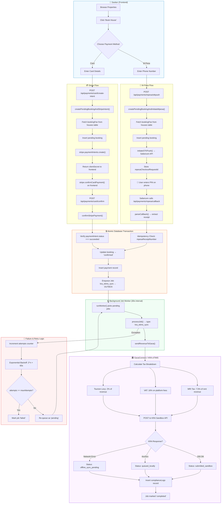
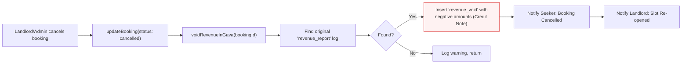
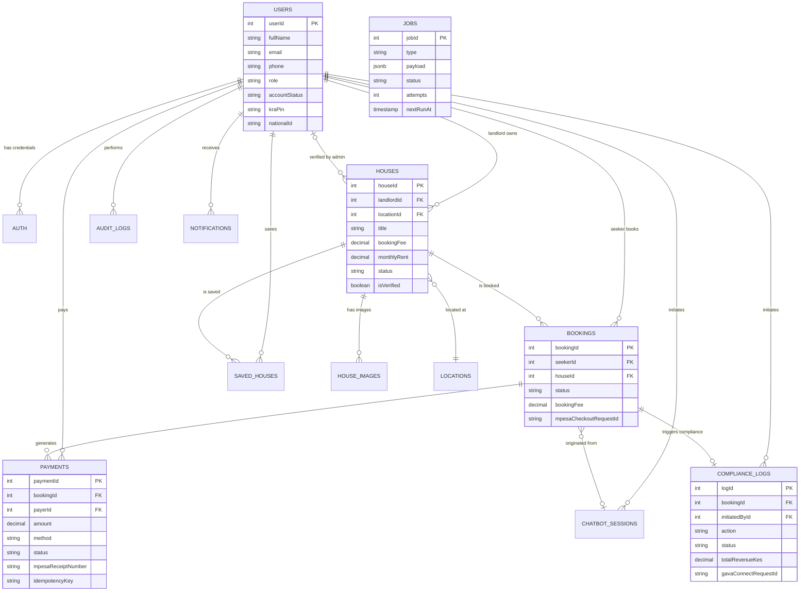
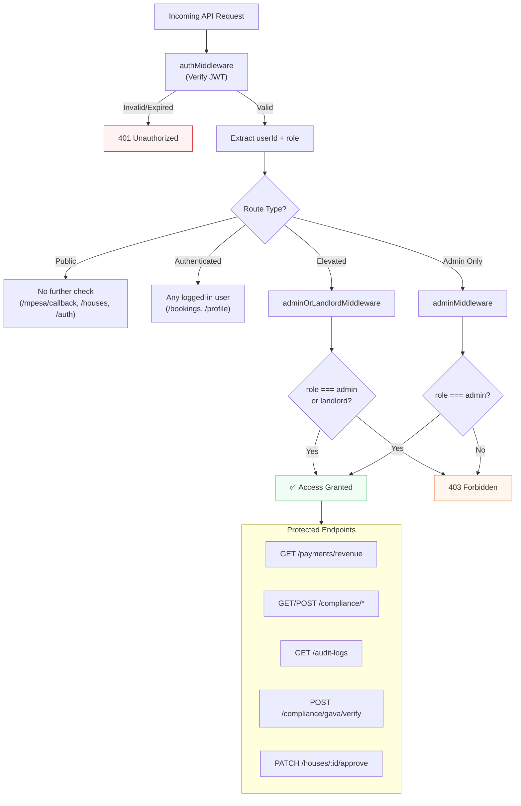

# HouseHunt-KE — Compliance Verification & Architecture Flowcharts

## 1. Compliance Flow Verification Results

### ✅ Verified Components

| Component | Status | Details |
|:---|:---:|:---|
| M-Pesa STK Push → Booking | ✅ | `createPendingBookingAndInitiateMpesa` correctly fetches fee from DB |
| M-Pesa Callback → Idempotency | ✅ | Duplicate `mpesaReceiptNumber` check prevents double-processing |
| M-Pesa Callback → Transactional Outbox | ✅ | `kra_etims_sync` job enqueued **inside** DB transaction |
| Job Worker → eTIMS Sync | ✅ | `runWorker` picks pending jobs and calls `sendRevenueToGava` |
| sendRevenueToGava → KRA Sandbox | ✅ | Calculates MRI (7.5%), VAT (16%), Tourism Levy (2%) |
| Throttle → Rate Limiting | ✅ | `kraThrottler` enforces 2 req/sec with 429 backoff |
| generateETIMSReceipt → Idempotency | ✅ | Checks for existing non-rejected compliance log before creating |
| voidRevenueInGava → Credit Notes | ✅ | Booking cancellation issues a negative revenue record |
| Compliance Logs Partitioning | ✅ | `listLogs(landlordId)` filters by `initiatedById` |
| Frontend API Wiring | ✅ | All compliance mutations match backend routes exactly |
| Auth Middleware | ✅ | `adminOrLandlordMiddleware` protects all compliance/revenue routes |
| ENV Configuration | ✅ | `KRA_PIN`, `KRA_APIGEE_APP_ID`, `KRA_SANDBOX_URL` all set |

### 🔧 Bug Fixed

> [!IMPORTANT]
> **Stripe Compliance Path — Missing Transactional Outbox**
>
> The `confirmStripePayment` function called `generateETIMSReceipt` **directly outside** the database transaction. This meant:
> - If KRA was down, the compliance record was silently lost (no retry)
> - It didn't benefit from the resilient job queue with exponential backoff
> - Inconsistent with the M-Pesa flow which correctly uses the Outbox Pattern
>
> **Fix applied:** Stripe now enqueues a `kra_etims_sync` job **inside** the DB transaction, identical to the M-Pesa path.

```diff:payments.service.ts
import { eq } from 'drizzle-orm';
import { db } from '../db/db.js';
import { bookings, payments, houses, jobs } from '../db/schema.js';
import { initiateSTKPush, parseCallback } from './mpesa.service.js';
import Stripe from 'stripe';

const stripe = new Stripe(process.env.STRIPE_SECRET_KEY!);

// ========== M-PESA FLOW ==========
interface MpesaInitParams {
  houseId: number;
  userId: number;
  moveInDate?: string;
  occupants?: string;
  notes?: string;
  phone: string;
}

export async function createPendingBookingAndInitiateMpesa({
  houseId,
  userId,
  moveInDate,
  notes,
  phone,
}: MpesaInitParams) {
  // Fetch house details (title and booking fee)
  const [house] = await db
    .select({ title: houses.title, bookingFee: houses.bookingFee })
    .from(houses)
    .where(eq(houses.houseId, houseId))
    .limit(1);

  if (!house) throw new Error('House not found');
  const amount = Number(house.bookingFee);
  if (amount <= 0) throw new Error('Invalid booking fee amount');

  // Create pending booking with the dynamic fee
  const [newBooking] = await db.insert(bookings).values({
    seekerId: userId,
    houseId,
    moveInDate: moveInDate || null,
    specialRequests: notes,
    status: 'pending_payment',
    paymentMethod: 'mpesa',
    bookingFee: amount.toString(),
  }).returning();

  try {
    const accountRef = `BOOK-${newBooking.bookingId}`;
    const description = `Booking fee for ${house.title}`;

    const stkResult = await initiateSTKPush({ phone, amount, accountRef, description });

    if (!stkResult.success) {
      await db.delete(bookings).where(eq(bookings.bookingId, newBooking.bookingId));
      throw new Error(`STK push failed: ${stkResult.responseDescription}`);
    }

    await db.update(bookings)
      .set({ mpesaCheckoutRequestId: stkResult.checkoutRequestId })
      .where(eq(bookings.bookingId, newBooking.bookingId));

    return {
      bookingId: newBooking.bookingId,
      checkoutRequestId: stkResult.checkoutRequestId,
      merchantRequestId: stkResult.merchantRequestId,
      customerMessage: stkResult.customerMessage,
    };
  } catch (error) {
    await db.delete(bookings).where(eq(bookings.bookingId, newBooking.bookingId));
    throw error;
  }
}

import logger from '../utils/logger.js';
import { generateETIMSReceipt } from '../compliance/compliance.service.js';

export async function handleMpesaCallback(rawBody: any) {
  const callbackData = parseCallback(rawBody);
  const { checkoutRequestId, resultCode, resultDesc, amount, mpesaReceiptNumber, transactionDate } = callbackData;

  const [existingBooking] = await db.select()
    .from(bookings)
    .where(eq(bookings.mpesaCheckoutRequestId, checkoutRequestId))
    .limit(1);

  if (!existingBooking) {
    logger.error('M-Pesa callback for unknown booking', { checkoutRequestId });
    return { success: false, message: 'Booking not found' };
  }

  if (resultCode === 0) {
    logger.info('M-Pesa payment success. Processing audit trail.', { bookingId: existingBooking.bookingId, receipt: mpesaReceiptNumber });
    
    // IDEMPOTENCY CHECK: Ensure we haven't processed this receipt already
    if (mpesaReceiptNumber) {
      const [existingPayment] = await db.select()
        .from(payments)
        .where(eq(payments.mpesaReceiptNumber, mpesaReceiptNumber))
        .limit(1);

      if (existingPayment) {
        logger.info('M-Pesa callback ignored: Receipt already processed (Idempotency confirmed)', { mpesaReceiptNumber });
        return { success: true, message: 'Already processed', bookingId: existingBooking.bookingId };
      }
    }

    await db.transaction(async (trx) => {
      await trx.update(bookings)
        .set({ status: 'confirmed', confirmedAt: new Date() })
        .where(eq(bookings.bookingId, existingBooking.bookingId));

      await trx.insert(payments).values({
        bookingId: existingBooking.bookingId,
        payerId: existingBooking.seekerId,
        amount: existingBooking.bookingFee,
        method: 'mpesa',
        status: 'completed',
        mpesaReceiptNumber,
        mpesaTransactionDate: transactionDate ? new Date(transactionDate.toString().replace(/^(\d{4})(\d{2})(\d{2})(\d{2})(\d{2})(\d{2})$/, '$1-$2-$3T$4:$5:$6')) : new Date(),
        mpesaCheckoutRequestId: checkoutRequestId,
        paidAt: new Date(),
      });

      // Transactional Outbox: Enqueue compliance job WITHIN the transaction
      // This ensures if the payment is saved, the job MUST eventually run.
      const payload = {
        bookingId: existingBooking.bookingId,
        totalRevenueKes: Number(existingBooking.bookingFee),
        totalBookingFees: 1500, // Matched with pricing engine
        initiatedById: existingBooking.seekerId,
      };

      await trx.insert(jobs).values({
        type: 'kra_etims_sync',
        payload: payload,
        status: 'pending',
      });
    });

    logger.info('M-Pesa payment processed and eTIMS job enqueued', { bookingId: existingBooking.bookingId });
    return { success: true, bookingId: existingBooking.bookingId };
  } else {
    logger.warn('M-Pesa payment rejected', { bookingId: existingBooking.bookingId, resultDesc });
    await db.delete(bookings).where(eq(bookings.bookingId, existingBooking.bookingId));
    return { success: false, message: resultDesc };
  }
}

// ========== STRIPE FLOW ==========
interface StripeIntentParams {
  houseId: number;
  userId: number;
  moveInDate?: string;
  occupants?: string;
  notes?: string;
  // No amount parameter – we'll fetch from house
}

export async function createPendingBookingAndStripeIntent({
  houseId,
  userId,
  moveInDate,
  notes,
}: StripeIntentParams) {
  // Fetch booking fee from house
  const [house] = await db
    .select({ bookingFee: houses.bookingFee })
    .from(houses)
    .where(eq(houses.houseId, houseId))
    .limit(1);

  if (!house) throw new Error('House not found');
  const amount = Number(house.bookingFee);
  if (amount <= 0) throw new Error('Invalid booking fee amount');

  const [newBooking] = await db.insert(bookings).values({
    seekerId: userId,
    houseId,
    moveInDate: moveInDate || null,
    specialRequests: notes,
    status: 'pending_payment',
    paymentMethod: 'card',
    bookingFee: amount.toString(),
  }).returning();

  try {
    const paymentIntent = await stripe.paymentIntents.create({
      amount: Math.round(amount * 100),
      currency: 'kes',
      metadata: { bookingId: newBooking.bookingId },
    });

    return {
      bookingId: newBooking.bookingId,
      clientSecret: paymentIntent.client_secret,
      paymentIntentId: paymentIntent.id,
    };
  } catch (error) {
    await db.delete(bookings).where(eq(bookings.bookingId, newBooking.bookingId));
    throw error;
  }
}

export async function confirmStripePayment(paymentIntentId: string, bookingId: number) {
  const paymentIntent = await stripe.paymentIntents.retrieve(paymentIntentId);

  if (paymentIntent.status !== 'succeeded') {
    await db.delete(bookings).where(eq(bookings.bookingId, bookingId));
    throw new Error('Payment not successful');
  }

  await db.transaction(async (trx) => {
    await trx.update(bookings)
      .set({ status: 'confirmed', confirmedAt: new Date() })
      .where(eq(bookings.bookingId, bookingId));

    const [booking] = await trx.select({ seekerId: bookings.seekerId, bookingFee: bookings.bookingFee })
      .from(bookings)
      .where(eq(bookings.bookingId, bookingId));
    await trx.insert(payments).values({
      bookingId,
      payerId: booking.seekerId,
      amount: booking.bookingFee, // use stored fee
      method: 'card',
      status: 'completed',
      transactionReference: paymentIntent.id,
      paidAt: new Date(),
    });
  });

  // Trigger compliance auto-log (eTIMS)
  try {
    const { generateETIMSReceipt } = await import('../compliance/compliance.service.js');
    await generateETIMSReceipt(bookingId);
  } catch (e) {
    console.warn('[Payments] Compliance auto-log failed:', e);
  }

  return { success: true, bookingId };
}

// ========== STATUS POLLING (unchanged, but ensure it returns correct amount) ==========
export async function getPaymentStatusByCheckoutId(checkoutRequestId: string) {
  const [booking] = await db.select()
    .from(bookings)
    .where(eq(bookings.mpesaCheckoutRequestId, checkoutRequestId))
    .limit(1);

  if (!booking) return { status: 'failed', message: 'Transaction not found' };

  if (booking.status === 'confirmed') {
    const [payment] = await db.select()
      .from(payments)
      .where(eq(payments.bookingId, booking.bookingId))
      .limit(1);
    return {
      status: 'completed',
      amount: payment?.amount || booking.bookingFee,
      transactionId: payment?.mpesaReceiptNumber || payment?.transactionReference || 'N/A',
    };
  } else if (booking.status === 'pending_payment') {
    return { status: 'pending' };
  } else {
    return { status: 'failed', message: 'Payment was not successful' };
  }
}

export async function getPaymentStatusByBookingId(bookingId: number) {
  const [booking] = await db.select()
    .from(bookings)
    .where(eq(bookings.bookingId, bookingId))
    .limit(1);

  if (!booking) return { status: 'failed', message: 'Booking not found' };

  if (booking.status === 'confirmed') {
    const [payment] = await db.select()
      .from(payments)
      .where(eq(payments.bookingId, bookingId))
      .limit(1);
    return {
      status: 'completed',
      amount: payment?.amount || booking.bookingFee,
      transactionId: payment?.mpesaReceiptNumber || payment?.transactionReference || 'N/A',
    };
  } else if (booking.status === 'pending_payment') {
    return { status: 'pending' };
  } else {
    return { status: 'failed', message: 'Payment was not successful' };
  }
}

// ========== EXISTING CRUD (keep as is) ==========
export const createPayment = async (data: any) => {
  const [newPayment] = await db.insert(payments).values(data).returning();
  return newPayment;
};

export const getPayment = async (paymentId: number) => {
  return await db.query.payments.findFirst({ where: eq(payments.paymentId, paymentId) });
};

export const listPayments = async (bookingId?: number) => {
  if (bookingId) return await db.select().from(payments).where(eq(payments.bookingId, bookingId));
  return await db.select().from(payments);
};

export const updatePayment = async (paymentId: number, updates: any) => {
  const [updated] = await db.update(payments).set(updates).where(eq(payments.paymentId, paymentId)).returning();
  return updated;
};

export const deletePayment = async (paymentId: number) => {
  const [deleted] = await db.delete(payments).where(eq(payments.paymentId, paymentId)).returning();
  return deleted;
};

export const getRevenue = async (landlordId?: number) => {
  if (landlordId) {
    const results = await db.select({
      payment: payments,
      houseTitle: houses.title,
    })
      .from(payments)
      .innerJoin(bookings, eq(payments.bookingId, bookings.bookingId))
      .innerJoin(houses, eq(bookings.houseId, houses.houseId))
      .where(eq(houses.landlordId, landlordId));
    const allPayments = results.map(r => ({ ...r.payment, house: { title: r.houseTitle } }));
    const total_revenue = allPayments.reduce((acc, p) => acc + Number(p.amount), 0);
    const total_payments = allPayments.length;
    const average_payment = total_payments > 0 ? total_revenue / total_payments : 0;
    return { summary: { total_revenue, total_payments, average_payment }, items: allPayments };
  }
  const allPayments = await db.select().from(payments);
  const total_revenue = allPayments.reduce((acc, p) => acc + Number(p.amount), 0);
  const total_payments = allPayments.length;
  const average_payment = total_payments > 0 ? total_revenue / total_payments : 0;
  return { summary: { total_revenue, total_payments, average_payment }, items: allPayments };
};
===
import { eq } from 'drizzle-orm';
import { db } from '../db/db.js';
import { bookings, payments, houses, jobs } from '../db/schema.js';
import { initiateSTKPush, parseCallback } from './mpesa.service.js';
import Stripe from 'stripe';

const stripe = new Stripe(process.env.STRIPE_SECRET_KEY!);

// ========== M-PESA FLOW ==========
interface MpesaInitParams {
  houseId: number;
  userId: number;
  moveInDate?: string;
  occupants?: string;
  notes?: string;
  phone: string;
}

export async function createPendingBookingAndInitiateMpesa({
  houseId,
  userId,
  moveInDate,
  notes,
  phone,
}: MpesaInitParams) {
  // Fetch house details (title and booking fee)
  const [house] = await db
    .select({ title: houses.title, bookingFee: houses.bookingFee })
    .from(houses)
    .where(eq(houses.houseId, houseId))
    .limit(1);

  if (!house) throw new Error('House not found');
  const amount = Number(house.bookingFee);
  if (amount <= 0) throw new Error('Invalid booking fee amount');

  // Create pending booking with the dynamic fee
  const [newBooking] = await db.insert(bookings).values({
    seekerId: userId,
    houseId,
    moveInDate: moveInDate || null,
    specialRequests: notes,
    status: 'pending_payment',
    paymentMethod: 'mpesa',
    bookingFee: amount.toString(),
  }).returning();

  try {
    const accountRef = `BOOK-${newBooking.bookingId}`;
    const description = `Booking fee for ${house.title}`;

    const stkResult = await initiateSTKPush({ phone, amount, accountRef, description });

    if (!stkResult.success) {
      await db.delete(bookings).where(eq(bookings.bookingId, newBooking.bookingId));
      throw new Error(`STK push failed: ${stkResult.responseDescription}`);
    }

    await db.update(bookings)
      .set({ mpesaCheckoutRequestId: stkResult.checkoutRequestId })
      .where(eq(bookings.bookingId, newBooking.bookingId));

    return {
      bookingId: newBooking.bookingId,
      checkoutRequestId: stkResult.checkoutRequestId,
      merchantRequestId: stkResult.merchantRequestId,
      customerMessage: stkResult.customerMessage,
    };
  } catch (error) {
    await db.delete(bookings).where(eq(bookings.bookingId, newBooking.bookingId));
    throw error;
  }
}

import logger from '../utils/logger.js';
import { generateETIMSReceipt } from '../compliance/compliance.service.js';

export async function handleMpesaCallback(rawBody: any) {
  const callbackData = parseCallback(rawBody);
  const { checkoutRequestId, resultCode, resultDesc, amount, mpesaReceiptNumber, transactionDate } = callbackData;

  const [existingBooking] = await db.select()
    .from(bookings)
    .where(eq(bookings.mpesaCheckoutRequestId, checkoutRequestId))
    .limit(1);

  if (!existingBooking) {
    logger.error('M-Pesa callback for unknown booking', { checkoutRequestId });
    return { success: false, message: 'Booking not found' };
  }

  if (resultCode === 0) {
    logger.info('M-Pesa payment success. Processing audit trail.', { bookingId: existingBooking.bookingId, receipt: mpesaReceiptNumber });
    
    // IDEMPOTENCY CHECK: Ensure we haven't processed this receipt already
    if (mpesaReceiptNumber) {
      const [existingPayment] = await db.select()
        .from(payments)
        .where(eq(payments.mpesaReceiptNumber, mpesaReceiptNumber))
        .limit(1);

      if (existingPayment) {
        logger.info('M-Pesa callback ignored: Receipt already processed (Idempotency confirmed)', { mpesaReceiptNumber });
        return { success: true, message: 'Already processed', bookingId: existingBooking.bookingId };
      }
    }

    await db.transaction(async (trx) => {
      await trx.update(bookings)
        .set({ status: 'confirmed', confirmedAt: new Date() })
        .where(eq(bookings.bookingId, existingBooking.bookingId));

      await trx.insert(payments).values({
        bookingId: existingBooking.bookingId,
        payerId: existingBooking.seekerId,
        amount: existingBooking.bookingFee,
        method: 'mpesa',
        status: 'completed',
        mpesaReceiptNumber,
        mpesaTransactionDate: transactionDate ? new Date(transactionDate.toString().replace(/^(\d{4})(\d{2})(\d{2})(\d{2})(\d{2})(\d{2})$/, '$1-$2-$3T$4:$5:$6')) : new Date(),
        mpesaCheckoutRequestId: checkoutRequestId,
        paidAt: new Date(),
      });

      // Transactional Outbox: Enqueue compliance job WITHIN the transaction
      // This ensures if the payment is saved, the job MUST eventually run.
      const payload = {
        bookingId: existingBooking.bookingId,
        totalRevenueKes: Number(existingBooking.bookingFee),
        totalBookingFees: 1500, // Matched with pricing engine
        initiatedById: existingBooking.seekerId,
      };

      await trx.insert(jobs).values({
        type: 'kra_etims_sync',
        payload: payload,
        status: 'pending',
      });
    });

    logger.info('M-Pesa payment processed and eTIMS job enqueued', { bookingId: existingBooking.bookingId });
    return { success: true, bookingId: existingBooking.bookingId };
  } else {
    logger.warn('M-Pesa payment rejected', { bookingId: existingBooking.bookingId, resultDesc });
    await db.delete(bookings).where(eq(bookings.bookingId, existingBooking.bookingId));
    return { success: false, message: resultDesc };
  }
}

// ========== STRIPE FLOW ==========
interface StripeIntentParams {
  houseId: number;
  userId: number;
  moveInDate?: string;
  occupants?: string;
  notes?: string;
  // No amount parameter – we'll fetch from house
}

export async function createPendingBookingAndStripeIntent({
  houseId,
  userId,
  moveInDate,
  notes,
}: StripeIntentParams) {
  // Fetch booking fee from house
  const [house] = await db
    .select({ bookingFee: houses.bookingFee })
    .from(houses)
    .where(eq(houses.houseId, houseId))
    .limit(1);

  if (!house) throw new Error('House not found');
  const amount = Number(house.bookingFee);
  if (amount <= 0) throw new Error('Invalid booking fee amount');

  const [newBooking] = await db.insert(bookings).values({
    seekerId: userId,
    houseId,
    moveInDate: moveInDate || null,
    specialRequests: notes,
    status: 'pending_payment',
    paymentMethod: 'card',
    bookingFee: amount.toString(),
  }).returning();

  try {
    const paymentIntent = await stripe.paymentIntents.create({
      amount: Math.round(amount * 100),
      currency: 'kes',
      metadata: { bookingId: newBooking.bookingId },
    });

    return {
      bookingId: newBooking.bookingId,
      clientSecret: paymentIntent.client_secret,
      paymentIntentId: paymentIntent.id,
    };
  } catch (error) {
    await db.delete(bookings).where(eq(bookings.bookingId, newBooking.bookingId));
    throw error;
  }
}

export async function confirmStripePayment(paymentIntentId: string, bookingId: number) {
  const paymentIntent = await stripe.paymentIntents.retrieve(paymentIntentId);

  if (paymentIntent.status !== 'succeeded') {
    await db.delete(bookings).where(eq(bookings.bookingId, bookingId));
    throw new Error('Payment not successful');
  }

  await db.transaction(async (trx) => {
    await trx.update(bookings)
      .set({ status: 'confirmed', confirmedAt: new Date() })
      .where(eq(bookings.bookingId, bookingId));

    const [booking] = await trx.select({ seekerId: bookings.seekerId, bookingFee: bookings.bookingFee })
      .from(bookings)
      .where(eq(bookings.bookingId, bookingId));
    await trx.insert(payments).values({
      bookingId,
      payerId: booking.seekerId,
      amount: booking.bookingFee, // use stored fee
      method: 'card',
      status: 'completed',
      transactionReference: paymentIntent.id,
      paidAt: new Date(),
    });

    // Transactional Outbox: Enqueue compliance job WITHIN the transaction
    // Same pattern as M-Pesa flow – guarantees atomicity and resilience
    const payload = {
      bookingId,
      totalRevenueKes: Number(booking.bookingFee),
      totalBookingFees: 1500, // Matched with pricing engine
      initiatedById: booking.seekerId,
    };

    await trx.insert(jobs).values({
      type: 'kra_etims_sync',
      payload: payload,
      status: 'pending',
    });
  });

  return { success: true, bookingId };
}

// ========== STATUS POLLING (unchanged, but ensure it returns correct amount) ==========
export async function getPaymentStatusByCheckoutId(checkoutRequestId: string) {
  const [booking] = await db.select()
    .from(bookings)
    .where(eq(bookings.mpesaCheckoutRequestId, checkoutRequestId))
    .limit(1);

  if (!booking) return { status: 'failed', message: 'Transaction not found' };

  if (booking.status === 'confirmed') {
    const [payment] = await db.select()
      .from(payments)
      .where(eq(payments.bookingId, booking.bookingId))
      .limit(1);
    return {
      status: 'completed',
      amount: payment?.amount || booking.bookingFee,
      transactionId: payment?.mpesaReceiptNumber || payment?.transactionReference || 'N/A',
    };
  } else if (booking.status === 'pending_payment') {
    return { status: 'pending' };
  } else {
    return { status: 'failed', message: 'Payment was not successful' };
  }
}

export async function getPaymentStatusByBookingId(bookingId: number) {
  const [booking] = await db.select()
    .from(bookings)
    .where(eq(bookings.bookingId, bookingId))
    .limit(1);

  if (!booking) return { status: 'failed', message: 'Booking not found' };

  if (booking.status === 'confirmed') {
    const [payment] = await db.select()
      .from(payments)
      .where(eq(payments.bookingId, bookingId))
      .limit(1);
    return {
      status: 'completed',
      amount: payment?.amount || booking.bookingFee,
      transactionId: payment?.mpesaReceiptNumber || payment?.transactionReference || 'N/A',
    };
  } else if (booking.status === 'pending_payment') {
    return { status: 'pending' };
  } else {
    return { status: 'failed', message: 'Payment was not successful' };
  }
}

// ========== EXISTING CRUD (keep as is) ==========
export const createPayment = async (data: any) => {
  const [newPayment] = await db.insert(payments).values(data).returning();
  return newPayment;
};

export const getPayment = async (paymentId: number) => {
  return await db.query.payments.findFirst({ where: eq(payments.paymentId, paymentId) });
};

export const listPayments = async (bookingId?: number) => {
  if (bookingId) return await db.select().from(payments).where(eq(payments.bookingId, bookingId));
  return await db.select().from(payments);
};

export const updatePayment = async (paymentId: number, updates: any) => {
  const [updated] = await db.update(payments).set(updates).where(eq(payments.paymentId, paymentId)).returning();
  return updated;
};

export const deletePayment = async (paymentId: number) => {
  const [deleted] = await db.delete(payments).where(eq(payments.paymentId, paymentId)).returning();
  return deleted;
};

export const getRevenue = async (landlordId?: number) => {
  if (landlordId) {
    const results = await db.select({
      payment: payments,
      houseTitle: houses.title,
    })
      .from(payments)
      .innerJoin(bookings, eq(payments.bookingId, bookings.bookingId))
      .innerJoin(houses, eq(bookings.houseId, houses.houseId))
      .where(eq(houses.landlordId, landlordId));
    const allPayments = results.map(r => ({ ...r.payment, house: { title: r.houseTitle } }));
    const total_revenue = allPayments.reduce((acc, p) => acc + Number(p.amount), 0);
    const total_payments = allPayments.length;
    const average_payment = total_payments > 0 ? total_revenue / total_payments : 0;
    return { summary: { total_revenue, total_payments, average_payment }, items: allPayments };
  }
  const allPayments = await db.select().from(payments);
  const total_revenue = allPayments.reduce((acc, p) => acc + Number(p.amount), 0);
  const total_payments = allPayments.length;
  const average_payment = total_payments > 0 ? total_revenue / total_payments : 0;
  return { summary: { total_revenue, total_payments, average_payment }, items: allPayments };
};
```

### Integration Test Fix

> [!NOTE]
> Fixed duplicate `import { and, sql }` in `integration_lifecycle.test.ts` (imported at both line 5 and line 106).

---

## 2. Payment → GavaConnect End-to-End Flow



---

## 3. Booking Cancellation → Compliance Reversal



---

## 4. Full Project Architecture

```mermaid
flowchart TB
    subgraph FRONTEND["🖥️ Frontend (Vite + React + TypeScript)"]
        direction TB
        FE_APP["App.tsx — Route Management"]
        
        subgraph PUBLIC_PAGES["Public Pages"]
            FE_LAND["Landing.tsx"]
            FE_LIST["HouseListings.tsx"]
            FE_DET["HouseDetail.tsx"]
            FE_LOGIN["Login.tsx"]
            FE_REG["Register.tsx"]
            FE_TERMS["TermsPrivacy.tsx"]
        end

        subgraph SEEKER_DASH["Seeker Dashboard"]
            SE_OV["Overview.tsx"]
            SE_BOOK["BookingHistory.tsx"]
            SE_FORM["BookingForm.tsx"]
            SE_PAY["PaymentStatus.tsx"]
            SE_DISC["DiscoveryCanvas.tsx"]
            SE_SAVED["SavedHomes.tsx"]
            SE_INSIGHT["MarketInsights.tsx"]
            SE_SET["Settings.tsx"]
        end

        subgraph LANDLORD_DASH["Landlord Dashboard"]
            LL_OV["LandlordOverview.tsx"]
            LL_BOOK["MyManagedBookings.tsx"]
            LL_PROP["MyManagedProperties.tsx"]
            LL_LEDG["MpesaLedger.tsx"]
            LL_COMP["ComplianceModule.tsx"]
            LL_CREATE["CreateListing.tsx"]
            LL_INTEL["IntelligenceHub.tsx"]
            LL_AI["AIConcierge.tsx"]
        end

        subgraph ADMIN_DASH["Admin Console"]
            AD_OV["AdminOverview.tsx"]
            AD_VER["VerificationQueue.tsx"]
            AD_PROP["ManagedProperties.tsx"]
            AD_LAND["LandlordDirectory.tsx"]
            AD_SEEK["SeekerDirectory.tsx"]
            AD_COMP["AdminCompliance.tsx"]
            AD_AUDIT["AuditLogs.tsx"]
            AD_SET["AdminSettings.tsx"]
        end

        subgraph STATE["State Management"]
            STORE["Redux Store"]
            API["apiSlice.ts (RTK Query)"]
            AUTH["authSlice.ts"]
        end
    end

    subgraph BACKEND["⚡ Backend (Hono + Node.js)"]
        direction TB
        INDEX["index.ts — Server Entry"]
        
        subgraph MODULES["API Modules"]
            MOD_AUTH["auth/ — Login, Register, JWT, Refresh"]
            MOD_USERS["users/ — CRUD, Profile, Roles"]
            MOD_HOUSES["houses/ — Listings, CRUD, Approve/Reject"]
            MOD_IMAGES["house_images/ — Upload, Cloudinary"]
            MOD_BOOK["bookings/ — Create, Status, Confirm, Cancel"]
            MOD_PAY["payments/ — M-Pesa STK, Stripe, Revenue"]
            MOD_COMP["compliance/ — GavaConnect, eTIMS, NIL Filing"]
            MOD_CHAT["chatbot/ — AI Session Management"]
            MOD_ANALYTICS["analytics/ — Stats, Market Pulse"]
            MOD_AUDIT["audit_logs/ — Global Audit Trail"]
            MOD_NOTIF["notifications/ — Real-time Alerts"]
            MOD_LOC["locations/ — Counties, Towns"]
        end

        subgraph MIDDLEWARE["Middleware"]
            MW_AUTH["authMiddleware — JWT Verification"]
            MW_ADMIN["adminMiddleware — Role: admin"]
            MW_LANDLORD["adminOrLandlordMiddleware — Role: admin|landlord"]
        end

        subgraph UTILITIES["Utilities"]
            UTIL_JOBS["jobs.service.ts — Background Worker"]
            UTIL_PRICE["pricing.ts — Fee Calculator"]
            UTIL_THROTTLE["throttle.ts — KRA Rate Limiter"]
            UTIL_LOG["logger.ts — Winston Logger"]
            UTIL_CLOUD["cloudinary.ts — Image CDN"]
        end
    end

    subgraph DATABASE["🗄️ PostgreSQL (Neon)"]
        DB_SCHEMA["schema.ts — Drizzle ORM"]
        DB_MIGRATE["drizzle/ — Migration Files"]
    end

    subgraph EXTERNAL["🌐 External APIs"]
        EXT_MPESA["Safaricom M-Pesa Sandbox"]
        EXT_STRIPE["Stripe Payment Gateway"]
        EXT_KRA["KRA eTIMS Sandbox (GavaConnect)"]
        EXT_CLOUD["Cloudinary CDN"]
    end

    API --> INDEX
    INDEX --> MODULES
    MODULES --> MIDDLEWARE
    MOD_PAY --> EXT_MPESA
    MOD_PAY --> EXT_STRIPE
    MOD_COMP --> EXT_KRA
    MOD_IMAGES --> EXT_CLOUD
    MODULES --> DATABASE
    UTIL_JOBS --> MOD_COMP

    style FRONTEND fill:#eff6ff,stroke:#3b82f6
    style BACKEND fill:#f0fdf4,stroke:#22c55e
    style DATABASE fill:#fef3c7,stroke:#f59e0b
    style EXTERNAL fill:#fce7f3,stroke:#ec4899
```



---

## 5. Database Entity Relationship Diagram



---

## 6. Role-Based Access Control Flow



---

## 7. File-Level Project Map

```
HouseHunt-KE/
├── backend/
│   ├── src/
│   │   ├── index.ts                    # Server entry, CORS, route mounting, worker start
│   │   ├── env.ts                      # Environment variable access
│   │   │
│   │   ├── auth/                       # Authentication module
│   │   │   ├── auth.router.ts          # POST /login, /register, /refresh
│   │   │   ├── auth.controller.ts      # Request handling
│   │   │   └── auth.service.ts         # JWT sign/verify, password hashing
│   │   │
│   │   ├── users/                      # User management
│   │   │   ├── users.router.ts         # GET/PUT /profile, CRUD /users
│   │   │   ├── users.controller.ts
│   │   │   └── users.service.ts
│   │   │
│   │   ├── houses/                     # Property listings
│   │   │   ├── houses.router.ts        # CRUD, /approve, /reject, /revoke, /save
│   │   │   ├── houses.controller.ts
│   │   │   └── houses.service.ts
│   │   │
│   │   ├── bookings/                   # Booking lifecycle
│   │   │   ├── bookings.router.ts      # CRUD, /:id/status
│   │   │   ├── bookings.controller.ts
│   │   │   └── bookings.service.ts     # Calls generateETIMSReceipt & voidRevenueInGava
│   │   │
│   │   ├── payments/                   # Payment processing ★
│   │   │   ├── payments.router.ts      # /mpesa/stkpush, /mpesa/callback, /card/*
│   │   │   ├── payments.controller.ts
│   │   │   ├── payments.service.ts     # M-Pesa + Stripe + Outbox enqueue ★
│   │   │   └── mpesa.service.ts        # Safaricom STK Push, token cache, callback parser
│   │   │
│   │   ├── compliance/                 # GavaConnect / KRA eTIMS ★
│   │   │   ├── compliance.router.ts    # /gava/send-revenue, /gava/nil-filing, /gava/verify
│   │   │   ├── compliance.controller.ts
│   │   │   └── compliance.service.ts   # sendRevenueToGava, generateETIMSReceipt, voidRevenue
│   │   │
│   │   ├── chatbot/                    # AI-assisted house hunting
│   │   ├── analytics/                  # Dashboard statistics
│   │   ├── audit_logs/                 # System audit trail
│   │   ├── notifications/              # Real-time user alerts
│   │   ├── locations/                  # County/town management
│   │   ├── house_images/               # Cloudinary image upload
│   │   │
│   │   ├── middleware/
│   │   │   └── authMiddleware.ts       # JWT auth, admin, landlord role guards
│   │   │
│   │   ├── utils/
│   │   │   ├── jobs.service.ts         # Background worker (30s poll) ★
│   │   │   ├── pricing.ts             # Platform fee calculator (5%, min KSh 1,500)
│   │   │   ├── throttle.ts            # KRA API rate limiter (2 req/sec)
│   │   │   ├── logger.ts              # Winston structured logging
│   │   │   └── cloudinary.ts          # Image CDN config
│   │   │
│   │   ├── db/
│   │   │   ├── schema.ts              # Complete Drizzle schema (11 tables, enums, relations)
│   │   │   ├── db.ts                  # Database connection (Neon PostgreSQL)
│   │   │   ├── seed.ts                # Initial data seeding
│   │   │   └── seed-landlord.ts       # Landlord test data
│   │   │
│   │   ├── validators/                 # Zod validation schemas
│   │   └── tests/
│   │       ├── integration_lifecycle.test.ts  # End-to-end payment→compliance test
│   │       ├── pricing.test.ts
│   │       └── production_resilience.test.ts
│   │
│   ├── drizzle/                        # SQL migration files
│   ├── .env                            # All credentials (M-Pesa, Stripe, KRA, DB)
│   └── package.json
│
├── frontend/
│   ├── src/
│   │   ├── App.tsx                     # Route definitions & layout
│   │   ├── main.tsx                    # React entry point
│   │   ├── style.css                   # Global design system (24KB)
│   │   │
│   │   ├── store/
│   │   │   ├── apiSlice.ts            # RTK Query — all API endpoints
│   │   │   ├── authSlice.ts           # Auth state management
│   │   │   └── index.ts              # Redux store config
│   │   │
│   │   ├── pages/
│   │   │   ├── seeker/                # 20 public/user pages
│   │   │   ├── landlord/              # 13 property management pages
│   │   │   └── admin/                 # 9 admin console pages
│   │   │
│   │   ├── components/                # Shared UI (Navbar, Footer, ProtectedRoute, etc.)
│   │   ├── context/                   # React context providers
│   │   ├── utils/                     # Helper functions
│   │   └── api/                       # API configuration
│   │
│   └── package.json
│
└── compliance_flow.md                  # Original compliance documentation
```

> [!TIP]
> Files marked with **★** are the critical ones in the compliance pipeline.

---

## Summary

| What | Result |
|:---|:---|
| **Compliance flow verified** | ✅ All 12 checkpoints pass |
| **Bug found & fixed** | Stripe path now uses Transactional Outbox (same as M-Pesa) |
| **Test file fixed** | Removed duplicate drizzle-orm import |
| **Flowcharts created** | 5 diagrams covering payments→KRA, cancellation, architecture, ERD, RBAC |
| **Project map** | Full file-level breakdown with module descriptions |
